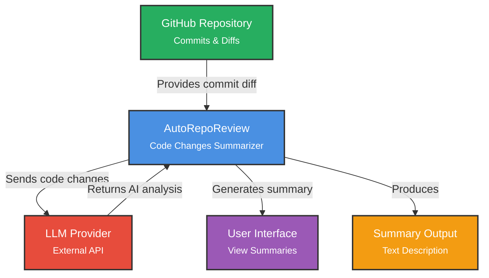

# AutoRepoReview

[](https://codecov.io/gh/AutoRepoReviewITPD/AutoRepoReview)

AI-powered git repository change analysis

## Quick Start

### Option 1: Download Pre-built Binary (Recommended)

1. **Download the latest release** from [GitHub Releases](https://github.com/AutoRepoReviewITPD/AutoRepoReview/releases)
   - **Windows**: Download `autoreporeview.exe`
   - **Linux**: Download `autoreporeview` (Linux binary)
   - **macOS**: Download `autoreporeview` (macOS binary)

2. **Make it executable** (Linux/macOS):
   ```bash
   chmod +x autoreporeview
   ```

3. **Run AutoRepoReview**:
   ```bash
   # Windows
   .\autoreporeview.exe summary <commit_a> <commit_b>
   
   # Linux/macOS
   ./autoreporeview summary <commit_a> <commit_b>
   ```

### Option 2: Run from Source

1. **Install [uv](https://docs.astral.sh/uv/getting-started/installation/)** (if you don't have it)

2. **Run AutoRepoReview** directly from GitHub:
   ```bash
   uvx --from git+https://github.com/AutoRepoReviewITPD/AutoRepoReview autoreporeview summary <commit_a> <commit_b>
   ```

That's it! Have fun.

### Local Development

For development, clone the repository and run:
```bash
uv run autoreporeview summary <commit_a> <commit_b>
```

### Building Binaries

Build standalone executables for Windows, Linux, and macOS using PyInstaller.

#### Prerequisites

1. Install build dependencies:
   ```bash
   uv sync --group dev
   ```

#### Building for Current Platform

Build a binary for your current operating system:
```bash
uv run pyinstaller --clean --name autoreporeview --onefile autoreporeview_cli.py
```

The binary will be created in the `dist/` directory:
- **Windows**: `dist/autoreporeview.exe`
- **Linux/macOS**: `dist/autoreporeview`

#### Cross-Platform Building

PyInstaller doesn't support cross-compilation. To build binaries for other platforms:

1. **Using GitHub Actions** (Recommended):
   - Push a version tag (e.g., `v0.1.0`) to trigger automated builds and create a release:
   ```bash
   # Create and push a version tag
   git tag v0.1.0
   git push origin v0.1.0
   ```
   - Binaries for Windows, Linux, and macOS will be automatically built and attached to a GitHub Release
   - The release will be available at [GitHub Releases](https://github.com/AutoRepoReviewITPD/AutoRepoReview/releases)

2. **Using Docker** (for Linux builds on Windows/macOS):
   ```bash
   docker run --rm -v "$(pwd):/src" python:3.13 bash -c "cd /src && pip install uv && uv sync --group dev && uv run pyinstaller --clean --name autoreporeview --onefile autoreporeview_cli.py"
   ```

3. **Using WSL** (for Linux builds on Windows):
   - Install WSL and Ubuntu
   - Follow the Linux build instructions inside WSL

4. **Native builds**:
   - Build Windows binaries on Windows
   - Build Linux binaries on Linux
   - Build macOS binaries on macOS

#### Testing the Binary

After building, test the binary:
```bash
# Windows
.\dist\autoreporeview.exe summary <commit_a> <commit_b>

# Linux/macOS
./dist/autoreporeview summary <commit_a> <commit_b>
```

### Creating a Release

To create a new release with pre-built binaries for all platforms:

1. **Ensure your changes are committed and pushed**:
   ```bash
   git add .
   git commit -m "Your commit message"
   git push origin main
   ```

2. **Create and push a version tag**:
   ```bash
   # Create a tag (use semantic versioning: vMAJOR.MINOR.PATCH)
   git tag v0.1.0
   
   # Push the tag to trigger the release workflow
   git push origin v0.1.0
   ```

3. **Monitor the workflow**:
   - Go to the [Actions](https://github.com/AutoRepoReviewITPD/AutoRepoReview/actions) tab to see the build progress
   - Once complete, the release will appear in [Releases](https://github.com/AutoRepoReviewITPD/AutoRepoReview/releases)
   - All three platform binaries will be attached to the release

**Note**: The tag name must start with `v` followed by a version number (e.g., `v0.1.0`, `v1.2.3`).

## Project Goals
- Automate routine review of repository changes
- Learn about the health and development dynamics of a project
- Quickly discover hidden patterns and issues in code
- Explain complex changes in simple terms using AI

## Description

This project develops a code summarizer tool that analyzes GitHub commits to generate concise summaries of code changes. It highlights key modifications, such as added/removed features, bug fixes, and the overall impact on functionality, enabling users to quickly understand what the new code can do without reviewing the entire diff.

## Threshold of Success Diagram

The project is considered successful if it meets the following criteria:
- Accurately summarizes at least 80% of simple commits (e.g., single-file changes) based on manual evaluation.
- Processes commits from public GitHub repositories in under 1 minute per commit.
- Provides readable summaries that include change type, affected components, and functional implications.
- Handles common programming languages like Python, JavaScript, and Java.
- Has a user-friendly interface, similar to the command-line interface of Git.
- Easily installable on Linux.

## Project Context



## Features Roadmap

### In Progress
- [ ] Commit difference summarization
- [ ] CLI for summary viewing

### Planned
- [ ] PDF report generation for visualization
- [ ] Advanced pattern recognition (identify stable, volatile, and recurrently-changing code patterns)
- [ ] Contributors activity analysis

## Documentation

**[View Documentation Site](https://AutoRepoReviewITPD.github.io/AutoRepoReview/)** with sprint reports, meeting notes, and project documentation.
- `./docs/sprints` — Contains scripts, meeting notes, sprint reports, and other iterative documentation reflecting project progress.
- `./docs/ai-usage.md` — Details how AI tools have been used within the project.
