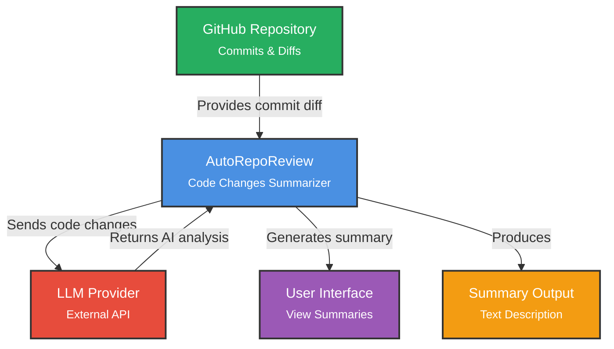

# AutoRepoReview

AI-powered git repository change analysis

## Project Goals
- Automate routine review of repository changes
- Learn about the health and development dynamics of a project
- Quickly discover hidden patterns and issues in code
- Explain complex changes in simple terms using AI

## Description

This project develops a code summarizer tool that analyzes GitHub commits to generate concise summaries of code changes. It highlights key modifications, such as added/removed features, bug fixes, and the overall impact on functionality, enabling users to quickly understand what the new code can do without reviewing the entire diff.

## Threshold of Success Diagram

The project is considered successful if it meets the following criteria:
- Accurately summarizes at least 80% of simple commits (e.g., single-file changes) based on manual evaluation.
- Processes commits from public GitHub repositories in under 1 minute per commit.
- Provides readable summaries that include change type, affected components, and functional implications.
- Handles common programming languages like Python, JavaScript, and Java.
- Has a user-friendly interface, similar to the command-line interface of Git.
- Easily installable on Linux.

## Project Context

## Features Roadmap

### In Progress
- [ ] Commit difference summarization
- [ ] CLI for summary viewing

### Planned
- [ ] PDF report generation for visualization
- [ ] Advanced pattern recognition (identify stable, volatile, and recurrently-changing code patterns)
- [ ] Contributors activity analysis

## Documentation

**[View Documentation Site](https://AutoRepoReviewITPD.github.io/AutoRepoReview/)** with sprint reports, meeting notes, and project documentation.
- `./docs/sprints` — Contains scripts, meeting notes, sprint reports, and other iterative documentation reflecting project progress.
- `./docs/ai-usage.md` — Details how AI tools have been used within the project.

## How to run prototype

1. Go to `prototype` directory
2. Install uv if you don't have it yet - https://docs.astral.sh/uv/getting-started/installation/
3. Run `uv run main.py <commit_a> <commit_b>`

