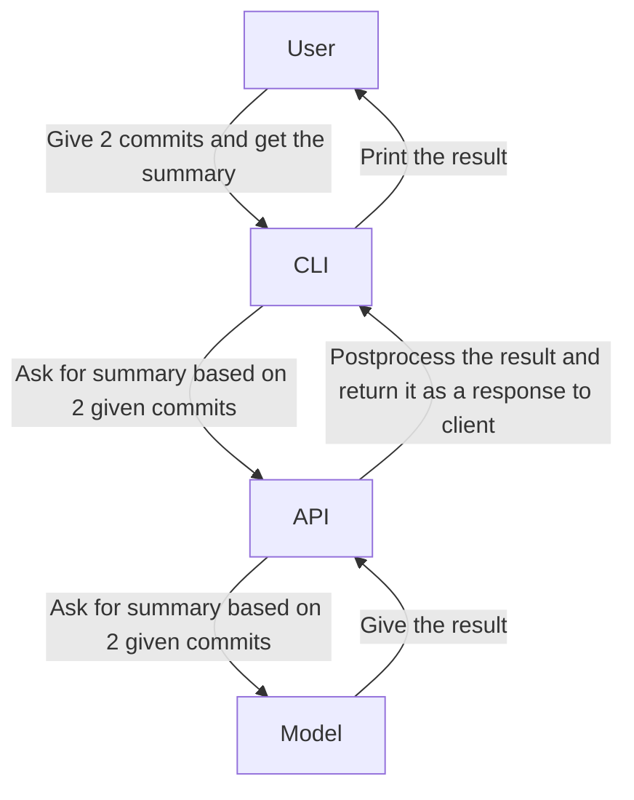

# Context Diagram

## External Actors

| Actor | Description |
|---|---|
|User|An individual that uses this project|
|CLI|A program that is used by user in terminal to interact with the system|
|API|A program that is used by CLI to use core of the system|
|LLM model|An LLM model that gives the summary of changes between 2 commits|

